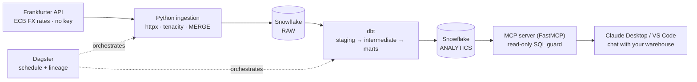

# Warehouse Copilot 🤖❄️

**An end-to-end AI data engineering platform: a public API → Snowflake → dbt → Dagster pipeline, topped with a Model Context Protocol (MCP) server that lets any LLM query the warehouse in plain English — safely.**


[](https://github.com/PreetRaut/warehouse-copilot/actions/workflows/ci.yml)


> Built to run entirely on Snowflake's **free 30-day trial ($400 credit, no credit card)** and free-tier tooling. Real cost to run: **€0**.

---

## Why this project

Most data-engineering portfolios stop at "I moved data into a warehouse."
This one goes further and shows the *AI* part of **AI data engineering**: once
the warehouse is modelled and tested, an **MCP server** exposes it to an LLM
(Claude Desktop, VS Code, any MCP client) so you can literally *ask your data
warehouse questions* — with hard read-only guarantees in front of it.

It deliberately uses the tools that show up in AI-data-engineering job specs:
**Snowflake, dbt, Dagster, Docker, GitHub Actions, MCP**, plus **Python** with
proper testing and linting.

## Architecture



Full detail in [`docs/architecture.md`](docs/architecture.md).

## What it demonstrates

- **ELT into Snowflake** — REST ingestion with retries and an **idempotent
  `MERGE`** load (re-runs never duplicate rows).
- **Analytics engineering with dbt** — layered `staging → intermediate → marts`,
  an **incremental** fact table, a seeded dimension, `dbt_utils`, source
  freshness, relationship/uniqueness/not-null **tests**, and generated docs.
- **Warehouse SQL** — daily returns, 7/30-day moving averages and rolling
  volatility via **window functions**.
- **AI interface (MCP)** — a custom **FastMCP** server with `run_query`,
  `list_tables`, `describe_table`, and `top_movers`, all behind a **read-only
  guard** (single statement, `SELECT`/`WITH` only, forbidden-keyword scan,
  auto-`LIMIT`, statement timeout).
- **Optional Snowflake Cortex** — a dbt model that uses in-warehouse LLM
  functions (`CORTEX.COMPLETE`) to write natural-language market commentary.
- **Orchestration** — **Dagster + dagster-dbt** with full asset lineage
  (`ingest → staging → marts`) and a daily schedule.
- **Engineering hygiene** — `pytest` unit tests, `ruff`, `sqlfluff`, **Docker**,
  and **GitHub Actions** CI that lints, tests, and compiles the dbt project.

## Tech stack

| Area | Tools |
|------|-------|
| Language | Python 3.12 |
| Warehouse | Snowflake |
| Ingestion | httpx, tenacity, pandas, `snowflake-connector-python` |
| Transformation | dbt (`dbt-snowflake`, `dbt_utils`) |
| AI / LLM | Model Context Protocol (FastMCP), Snowflake Cortex (optional) |
| Orchestration | Dagster, dagster-dbt |
| Quality & CI | pytest, ruff, sqlfluff, GitHub Actions, Docker |
| Config | pydantic-settings |

---

## Quickstart (macOS)

Prereqs: Python 3.12, [uv](https://docs.astral.sh/uv/) *or* venv, and a free
[Snowflake trial](https://signup.snowflake.com/) account.

```bash
git clone https://github.com/PreetRaut/warehouse-copilot.git
cd warehouse-copilot

# 1) Environment (uv is fastest on Mac; plain venv works too)
uv venv --python 3.12 && source .venv/bin/activate
uv pip install -e ".[dev,orchestration]"
#   ...or:  python3.12 -m venv .venv && source .venv/bin/activate && pip install -e ".[dev,orchestration]"

# 2) Prove the code works with zero setup (offline synthetic data)
make test
wc-ingest --synthetic --dry-run
```

### Connect Snowflake

1. Sign up for the trial and open a **Snowsight** worksheet as `ACCOUNTADMIN`.
2. Run [`scripts/bootstrap_snowflake.sql`](scripts/bootstrap_snowflake.sql)
   (creates a cost-safe `XSMALL` warehouse, the database/schemas, and **separate
   read/write and read-only roles**). Replace `<YOUR_USER>` first.
3. `cp .env.example .env` and fill in your account, user and password.

```bash
# 3) Load ~90 days of real FX data
wc-ingest

# 4) Transform + test in Snowflake
cd dbt/warehouse_copilot && dbt deps && dbt build && cd -
```

You now have `ANALYTICS.MART_FX_DAILY_METRICS` populated. 🎉

### Chat with your warehouse (MCP)

Point the MCP server at the **read-only** role, then register it with Claude
Desktop (`~/Library/Application Support/Claude/claude_desktop_config.json`):

```json
{
  "mcpServers": {
    "warehouse-copilot": {
      "command": "/absolute/path/to/warehouse-copilot/.venv/bin/wc-mcp",
      "env": {
        "SNOWFLAKE_ACCOUNT": "ab12345.eu-west-1",
        "SNOWFLAKE_USER": "your_user",
        "SNOWFLAKE_PASSWORD": "your_password",
        "SNOWFLAKE_ROLE": "WAREHOUSE_COPILOT_RO",
        "SNOWFLAKE_WAREHOUSE": "WH_XS",
        "SNOWFLAKE_DATABASE": "WAREHOUSE_COPILOT",
        "SNOWFLAKE_SCHEMA_ANALYTICS": "ANALYTICS"
      }
    }
  }
}
```

Restart Claude Desktop and ask things like *"Which currency was most volatile
against the euro last week?"* — it will call `top_movers` / `run_query` and
answer from live warehouse data. Prefer a UI to debug? `make mcp-inspector`.

### Orchestrate (Dagster)

```bash
make dagster   # http://localhost:3000 — see ingest → dbt lineage and the daily schedule
```

### Optional: Snowflake Cortex enrichment

```bash
cd dbt/warehouse_copilot && dbt build --vars '{enable_cortex: true}'
```

Generates `MART_MARKET_COMMENTARY` with an LLM-written summary of the latest
metrics (only if Cortex is available in your trial region).

---

## Project structure

```
warehouse-copilot/
├── src/warehouse_copilot/
│   ├── config.py               # pydantic-settings; lazy Snowflake connection
│   ├── ingest/                 # sources (Frankfurter + synthetic), loader (MERGE), CLI
│   └── mcp_server/             # sql_guard.py (read-only) + FastMCP server.py
├── dbt/warehouse_copilot/
│   ├── models/staging          # stg_fx_rates (+ source freshness/tests)
│   ├── models/intermediate     # int_fx_rates_enriched (ephemeral)
│   ├── models/marts            # dim_currency, fct_fx_rate (incremental), mart_fx_daily_metrics
│   ├── models/marts/ai         # mart_market_commentary (Cortex, optional)
│   └── seeds/                  # dim_currency_seed.csv
├── orchestration/…/definitions.py   # Dagster assets, schedule, dbt lineage
├── scripts/bootstrap_snowflake.sql  # trial-safe warehouse + RO/RW roles
├── tests/                      # pytest: sql guard, sources, config
├── .github/workflows/ci.yml    # ruff + pytest + dbt parse
├── Dockerfile · docker-compose.yml · Makefile · pyproject.toml
```

## Testing & CI

```bash
make lint    # ruff
make test    # pytest (SQL guard, source parsing, config)
```

CI runs on every push/PR: **ruff → pytest (with coverage) → `dbt deps` +
`dbt parse`** (compile-time validation, no Snowflake secrets required).

## Cost & safety notes

- **€0 on the trial.** `XSMALL` + `AUTO_SUSPEND = 60s` means compute only runs
  while a query runs.
- The MCP server is read-only twice over: application-level guard **and** a
  least-privilege Snowflake role. Never give an LLM `ACCOUNTADMIN`.
- Snowflake also ships an [official MCP server](https://github.com/Snowflake-Labs/mcp);
  this repo builds a focused one from scratch to demonstrate the pattern (and it
  can be swapped in via the same Claude Desktop config).

## Roadmap

- Great Expectations checks alongside dbt tests
- Key-pair auth for the MCP service user (instead of password)
- A second source (equities/crypto) to exercise multi-source modelling
- Streamlit-in-Snowflake dashboard over the marts

## Author

**Preet Raut** — Data & AI, Dublin
[LinkedIn](https://linkedin.com/in/preet-raut) · [GitHub](https://github.com/PreetRaut)

MIT licensed. Data © the European Central Bank via the Frankfurter API.
