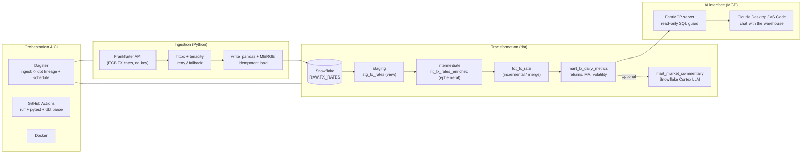

# Architecture

## Layers

| Layer | Tool | What it shows |
|-------|------|---------------|
| Ingestion | Python, httpx, tenacity, `write_pandas` + `MERGE` | REST ingestion, retries, idempotent loads |
| Warehouse | Snowflake | Cloud data warehouse, roles, cost-safe warehouse |
| Transformation | dbt (staging -> intermediate -> marts) | Analytics engineering, incremental models, tests, lineage |
| Analytics | Snowflake SQL window functions | Returns, moving averages, rolling volatility |
| AI (optional) | Snowflake Cortex `COMPLETE` | Native in-warehouse LLM enrichment |
| AI interface | MCP (FastMCP) | Natural-language, read-only access for LLM clients |
| Orchestration | Dagster + dagster-dbt | Scheduling and end-to-end asset lineage |
| Quality/CI | ruff, pytest, sqlfluff, GitHub Actions | Testing, linting, automation |
| Packaging | Docker | Reproducible runtime |

## Design decisions

- **Read-only by construction.** The MCP server routes every query through a
  pure SQL guard (single statement, `SELECT`/`WITH` only, forbidden-keyword
  scan, auto-`LIMIT`) *and* is meant to run under a dedicated read-only
  Snowflake role. Two independent layers of protection for LLM-driven queries.
- **Idempotent ingestion.** Loads MERGE on the natural key, so re-running any
  date range never duplicates rows.
- **Trial-safe cost.** An `XSMALL` warehouse with `AUTO_SUSPEND = 60s` keeps
  usage far inside the $400 / 30-day free trial.
- **Always runnable.** A deterministic synthetic data source means the pipeline
  and tests work with no API key and no internet.
